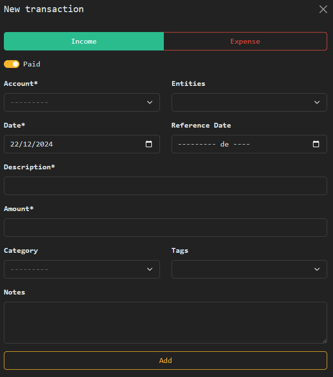
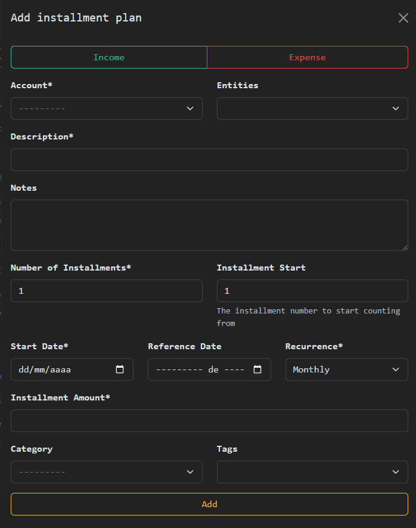
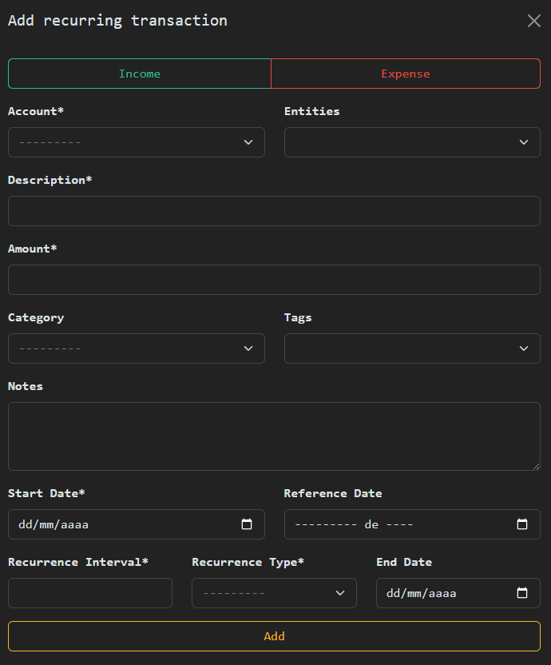
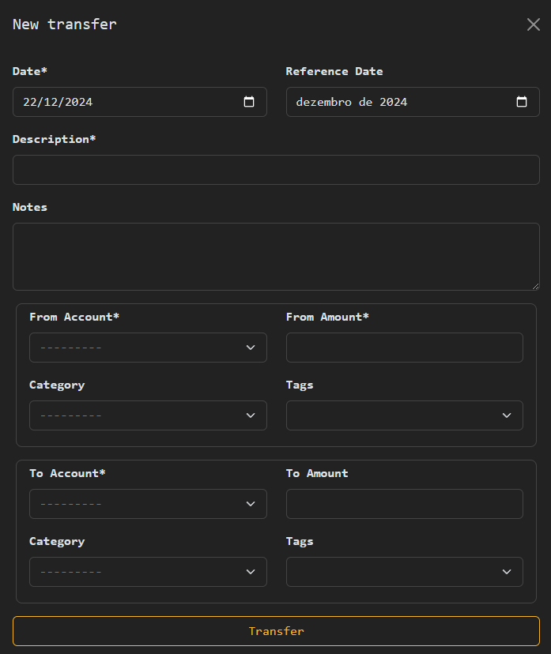
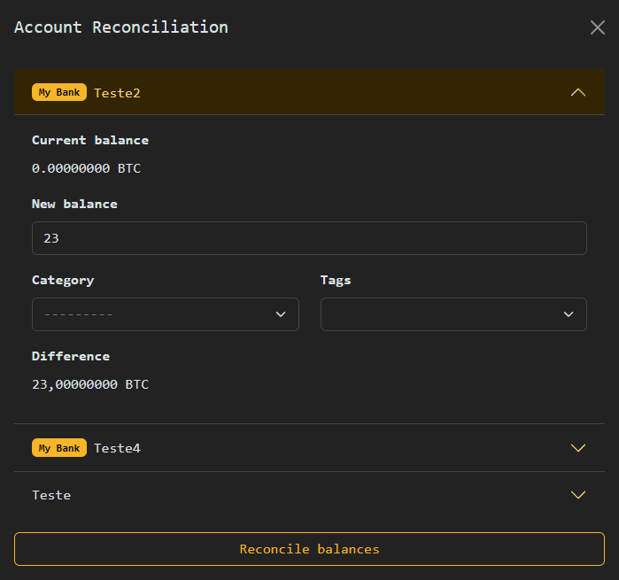
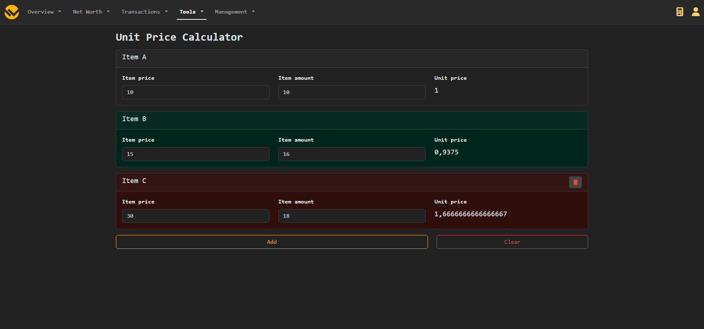

<h1 align="center">
  <br>
  
  <br>
  WYGIWYH
  <br>
</h1>

<h4 align="center">An opinionated and powerful finance tracker.</h4>

<p align="center">
  <a href="#why-wygiwyh">Why</a> •
  <a href="#key-features">Features</a> •
  <a href="#how-to-use">Usage</a> •
  <a href="#how-it-works">How</a> •
  <a href="#caveats-and-warnings">Caveats and Warnings</a> •
  <a href="#built-with">Built with</a>
</p>

**WYGIWYH** (_What You Get Is What You Have_) is a powerful, principles-first finance tracker designed for people who prefer a no-budget, straightforward approach to managing their money. With features like multi-currency support, customizable transactions, and a built-in dollar-cost averaging tracker, WYGIWYH helps you take control of your finances with simplicity and flexibility.

</img> </img> </img> </img> </img> 

# Why WYGIWYH?
Managing money can feel unnecessarily complex, but it doesn’t have to be. WYGIWYH (pronounced "wiggy-wih") is based on a simple principle:

> Use what you earn this month for this month. Any savings are tracked but treated as untouchable for future months.

By sticking to this straightforward approach, you avoid dipping into your savings while still keeping tabs on where your money goes.

While this philosophy is simple, finding tools to make it work wasn’t. I initially used a spreadsheet, which served me well for years—until it became unwieldy as I started managing multiple currencies, accounts, and investments. I tried various financial management apps, but none met my key requirements:

1. **Multi-currency support** to track income and expenses in different currencies.
2. **Not a budgeting app** — as I dislike budgeting constraints.
3. **Web app usability** (ideally with mobile support, though optional).
4. **Automation-ready API** to integrate with other tools and services.
5. **Custom transaction rules** for credit card billing cycles or similar quirks.

Frustrated by the lack of comprehensive options, I set out to build **WYGIWYH** — an opinionated yet powerful tool that I believe will resonate with like-minded users.

# Key Features

**WYGIWYH** offers an array of features designed to simplify and streamline your personal finance tracking:

* **Unified transaction tracking**: Record all your income and expenses, organized in one place.
* **Multiple accounts support**: Keep track of where your money and assets are stored (banks, wallets, investments, etc.).
* **Out-of-the-box multi-currency support**: Dynamically manage transactions and balances in different currencies.
* **Custom currencies**: Create your own currencies for crypto, rewards points, or any other models.
* **Automated adjustments with rules**: Automatically modify transactions using customizable rules.
* **Built-in Dollar-Cost Average (DCA) tracker**: Essential for tracking recurring investments, especially for crypto and stocks.
* **API support for automation**: Seamlessly integrate with existing services to synchronize transactions.

# How To Use

To run this application, you'll need [Docker](https://docs.docker.com/engine/install/) with [docker-compose](https://docs.docker.com/compose/install/).

From your command line:

```bash
# Clone this repository
$ mkdir WYGIWYH

# Go into the repository
$ cd WYGIWYH

$ touch docker-compose.yml
$ nano docker-compose.yml
# Paste the contents of https://github.com/eitchtee/WYGIWYH/blob/main/docker-compose.prod.yml and edit according to your needs

# Fill the .env file with your configurations
$ touch .env
$ nano .env # or any other editor you want to use
# Paste the contents of https://github.com/eitchtee/WYGIWYH/blob/main/.env.example and edit accordingly

# Run the app
$ docker compose up -d

# Create the first admin account
$ docker compose exec -it web python manage.py createsuperuser
```

## Running locally

If you want to run WYGIWYH locally, on your env file:

1. Remove `URL`
2. Set `HTTPS_ENABLED` to `false`
3. Leave the default `DJANGO_ALLOWED_HOSTS` (localhost 127.0.0.1 [::1])

You can now access localhost:OUTBOUND_PORT

> [!NOTE]
> If you're planning on running this behind Tailscale or other similar service also add your machine given IP to `DJANGO_ALLOWED_HOSTS`

> [!NOTE]
> If you're going to use another IP that isn't localhost, add it to `DJANGO_ALLOWED_HOSTS`, without `http://`

# How it works

## Models

### Transactions

Transactions are the core feature of WYGIWYH, representing expenses or income in your accounts. Each transaction consists of the following fields:

#### Type

- **Income**: A positive amount entering your account
- **Expense**: A negative amount exiting your account

#### Paid Status

A transaction can be either:

- **Current**: When marked as paid
- **Projected**: When marked as unpaid

#### Account

The account associated with the transaction. Required, limited to one account per transaction.

#### Entity

The party involved in the transaction:

- For **Income**: The paying entity
- For **Expense**: The receiving entity

Optional field.

#### Date

The date when the transaction occurred. Required.

#### Reference Date

One of **WYGIWYH**'s key features. The reference date determines which month a transaction should count towards. For example, you can have a transaction that occurred on January 26th count towards February's finances.

Optional - defaults to the transaction date's month if not specified.

> [!CAUTION]
> While designed primarily for credit card closing dates, this feature allows for debt rolling across months. Use responsibly to maintain accurate financial tracking.

#### Type

- Income, meaning a positive amount (usually) entering your account
- Expense, meaning a negative amount exiting your account

#### Description

The name or purpose of the transaction. Required.

#### Amount

The monetary value of the transaction. Required.

#### Category

The primary classification of the transaction. Optional.

#### Tags

Additional labels for transaction categorization. Optional.

#### Notes

Additional information about the transaction. Optional.



### Installment Plan

An Installment Plan is a helper model that generates a series of recurring transactions over a fixed period.

#### Core Fields

- **Account**: The account for all transactions in the plan. Required.
- **Entity**: The paying or receiving party for all transactions. Optional.
- **Description**: The name of the installment plan, used for all transactions. Required.
- **Notes**: Additional information applied to all transactions. Optional.

#### Installment Configuration

- **Number of Installments**: Total number of transactions to create (e.g., 1/10, 2/10)
- **Installment Start**: Initial counting point
- **Start Date**: Date of the first transaction
- **Reference Date**: Reference date for the first transaction
- **Recurrence**: Frequency of transactions (e.g., Monthly)



### Transaction Details

- **Amount**: Value for each transaction. Required.
- **Category**: Primary classification for all transactions. Optional.
- **Tags**: Labels applied to all transactions. Optional.

### Recurring Transaction
A Recurring Transaction is a helper model that generates recurring transactions indefinitely or until a certain date.

#### Core Fields

- **Account**: The account for all transactions in the plan. Required.
- **Entity**: The paying or receiving party for all transactions. Optional.
- **Description**: The name of the recurring transaction, used for all transactions. Required.
- **Notes**: Additional information applied to all transactions. Optional.

#### Recurring Transaction Configuration

- **Start Date**: Date of the first transaction. Required.
- **Reference Date**: Reference date for the first transaction. Optional.
- **Recurrence Type**: Frequency of transactions (e.g., Monthly). Required.
- **Recurrence Interval**: The interval between transactions (e.g. every 1 month, every 2 weeks, etc.). Required.
- **End date**: When new transactions should stop being created. Optional.

#### Transaction Details

- **Amount**: Value for each transaction. Required.
- **Category**: Primary classification for all transactions. Optional.
- **Tags**: Labels applied to all transactions. Optional.

#### Other information

- Recurring transactions are checked and created every midnight using Procrastinate.
- **WYGIWYH** tries to keep at most **6** future transactions created at any time.
- If you delete a recurring transaction it will not be recreated.
- You can stop or pause a recurring transaction at any time on the config page (/recurring-trasanctions/)



### Account

Accounts represent different financial entities where transactions occur. They have the following attributes:

- **Name**: A unique identifier for the account.
- **Group**: An optional [account group](#account-groups) the account belongs to for organizational purposes.
- **Currency**: The primary [currency](#currency) of the account.
- **Exchange Currency**: An optional currency used for exchange rate calculations.
- **Is Asset**: A boolean indicating if the account is considered an asset (counts towards net worth).
- **Is Archived**: A boolean indicating if the account is archived (doesn't show up in active lists or count towards net worth).

### Account Groups

Account Groups are used to organize accounts into logical categories. They consist of:

- **Name**: A unique identifier for the group.

### Currency

Currencies represent different monetary units. They include:

* **Code**: A unique identifier for the currency (e.g., USD, EUR).
* **Name**: The full name of the currency.
* **Decimal Place**: The number of decimal places used for the currency.
* **Prefix**: An optional symbol or text that comes before the amount.
* **Suffix**: An optional symbol or text that comes after the amount.

### Exchange Rate

Exchange Rates store conversion rates between currencies:

* **From Currency**: The source currency.
* **To Currency**: The target currency.
* **Rate**: The conversion rate.
* **Date**: The date the rate was recorded or is valid for.

### Category

Categories are used to classify transactions:

* **Name**: A unique identifier for the category.
* **Muted**: Muted categories won't count towards your monthly total.
* **Active**: A boolean indicating if the category is currently in use. This will disable its use on new transactions.

### Tag

Tags provide additional labeling for transactions:

* **Name**: A unique identifier for the tag.
* **Active**: A boolean indicating if the category is currently in use. This will disable its use on new transactions.

### Entity

Entities represent parties involved in transactions:

* **Name**: A unique identifier for the entity.
* **Active**: A boolean indicating if the entity is currently in use. This will disable its use on new transactions.

---

## Helper actions

### Transfer

A transfer happens when you move a monetary value from one account to another. This will create two transactions, one expense and one income with the values set by the user.

Contrary to other finance trackers, due to our multi-currency support, **WYGIWYH**'s transfer system allows for non-zero transfers.



### Balance (Account Reconciliation)

A balance is a easy way of updating your accounts balance. It creates a transaction with the difference between the balance currently in **WYGIWYH** and the new balance informed by you.

This can be useful for savings accounts or other interest accruing investments.

---

## Views

### Monthly

The Monthly view provides an overview of your financial activity for a specific month. It includes:

* Total income and expenses for the month
* Daily spending allowance calculation
* List of transactions for the month

> [!NOTE]
> Reference dates are taken into account here.

### Yearly by currency

This view gives you a yearly summary of your finances grouped by currency. It shows:

* Total income and expenses for each currency
* Monthly breakdown of income and expenses

### Yearly by account

Similar to the [yearly by currency](#yearly-by-currency) view, but groups the data by account instead.

### Calendar

The Calendar view presents your transactions in a monthly calendar format, allowing you to see your financial activity day by day. It includes:

* Visual representation of daily transaction totals
* Ability to view details of transactions for each day

> [!NOTE]
> Reference dates are **not** taken into account here.

### Networh

#### Current

The Current Net Worth view shows your present financial standing, including:

* Total value of all asset accounts
* Breakdown of assets by account and currency
* Historical net worth trend

#### Projected

The Projected Net Worth view estimates your future financial position based on current data and recurring transactions. It includes:

* Your total net worth with projected and current transactions
* Breakdown of assets by account and currency
* Historical and future net worth trend

### All Transactions

This view provides a comprehensive list of all transactions across all accounts. Features include:

* Advanced filtering and sorting options
* Detailed information

You can use this to see how much you spent on a given category, or a given day, etc..

### Configuration and Management

#### Management
The Management section in the navbar allows you to add and edit most elements of WYGIWYH, including:

* Accounts and Groups
* Currencies and Exchange Rates
* Categories, Tags and Entities
* Rules

#### User Settings

WYGIWYH allows users to personalize their experience through customizable settings. Each user can configure:

* **Language**: Choose your preferred interface language.
* **Timezone**: Set your local timezone for accurate date and time display.
* **Start Page**: Select which page you want to see first when you log in.
* **Sound Preferences**: Toggle sound effects on or off.
* **Amount Display**: Choose to show or hide monetary amounts by default.

To access and modify these settings:

1. Click on your username in the top-right corner of the page.
2. Select "Settings" from the dropdown menu.
3. Adjust your preferences as desired.
4. Click "Save" to apply your changes.

These settings ensure that WYGIWYH adapts to your personal preferences and working style.

#### Django Admin
From here you can also access Django's own admin site.

> [!WARNING]
> Most side effects aren't triggered from the admin.
> Only use it if you know what you're doing or were told by a developer to do so.

---

## Tools

### Calculator

The calculator is a floating widget that can be toggled by clicking the calculator icon on the navbar or by pressing <kbd>Alt</kbd> + <kbd>C</kbd> on any page.

It allows for any math expression supported by [math.js](https://mathjs.org).


### Dollar Cost Average Tracker

The DCA Tracker can be accessed from the navbar's **Tools** menu.

It allows for tracking DCA strategies and getting helpful information and insights.

> [!IMPORTANT]
> Currently DCA exists separately from your main transactions. You will need to add your entries manually.

</img> </img>

### Unit Price Calculator

The Unit Price Calculator can be accessed from the navbar's **Tools** menu.

This is a self-contained tool for comparing and finding the most cost-efficient item quickly and easily.

Input the price and the amount of each item, the cheapeast will be highlighted in green, and the most expensive in red.

You can add additional items by clicking the _Add_ button at the end of the page.

> [!NOTE]
> This doesn't do unit convertion. The amount of all items needs to be on the same the unit for proper functioning.



### Currency Converter

The Currency Converter is a tool that allows you to quickly convert amounts between different currencies.

> [!NOTE]
> There's no external Exchange Rate fetching. This uses the Exchange Rates configured in the [Management](#configuration-and-management) page for [Exchange Rates](#exchange-rate)

## Automation

### API

WYGIWYH has a comprehensive API, it's documentation can be accessed on `<your-wygiwyh-url>/api/docs/`

> [!NOTE]
> While the API works, there's still much to be added to it to equipare functionality with the main web app.

### Transaction Rules

Transaction Rules are a powerful feature in WYGIWYH that allow for automatic modification of transactions based on specified criteria. This can save time and ensure consistency in your financial tracking.

Key Aspects of Transaction Rules:

* **Conditions**: Set specific criteria that a transaction must meet for the rule to apply. This can include attributes like description, amount, account, etc.
* **Actions**: Define what changes should be made to a transaction when the conditions are met. This can include setting categories, tags, or modifying other fields.
* **Activation Options**: Rules can be set to apply when transactions are created, updated, or both.

#### Actions and Conditions

When creating a new rule, you will need to add a Condition and, later, Actions.

Both use a limited subset of Python, via [SimpleEval](https://github.com/danthedeckie/simpleeval).

The Condition must evaluate to True or False, and the Action must evaluate to a value that will be set on the selected field.

You may use any of the available [variables](#available-variables) and [functions](#available-functions).

#### Available variables

* `account_name`
* `account_id`
* `account_group_name`
* `account_group_id`
* `is_asset_account`
* `is_archived_account`
* `category_name`
* `category_id`
* `tag_names`
* `tag_ids`
* `entities_names`
* `entities_ids`
* `is_expense`
* `is_income`
* `is_paid`
* `description`
* `amount`
* `notes`
* `date`
* `reference_date`

#### Available functions

* `relativedelta`

#### Examples

Add a tag to an income transaction if it happens in a specific account

```
If...
account_name == "My Investing Account" and is_income

Then...
Set Tags to
tag_names + ["Yield"]
```

---

Move credit card transactions to next month when they happen at a cutoff date

```
If...
account_name == "My credit card" and date.day >= 26 and reference_date.month == date.month

Then...
Set Reference Date to
reference_date + relativedelta(months=1)).replace(day=1)
```
# Caveats and Warnings

- I'm not an accountant, some terms and even calculations might be wrong. Make sure to open an issue if you see anything that could be improved.
- Pretty much all calculations are done at run time, this can lead to some performance degradation. On my personal instance, I have 3000+ transactions over 4+ years and 4000+ exchange rates, and load times average at around 500ms for each page, not bad overall.
- This isn't a budgeting or double-entry-accounting application, if you need those features there's a lot of options out there, if you really need them in WYGIWYH, open a discussion.

# Built with

WYGIWYH is possible thanks to a lot of amazing open source tools, to name a few:

* Django
* HTMX
* _hyperscript
* Procrastinate
* Bootstrap
* Tailwind
* Webpack
* PostgreSQL
* Django REST framework
* Alpine.js
